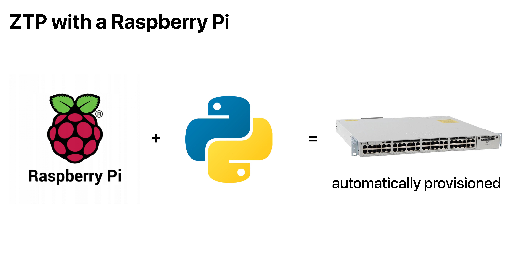
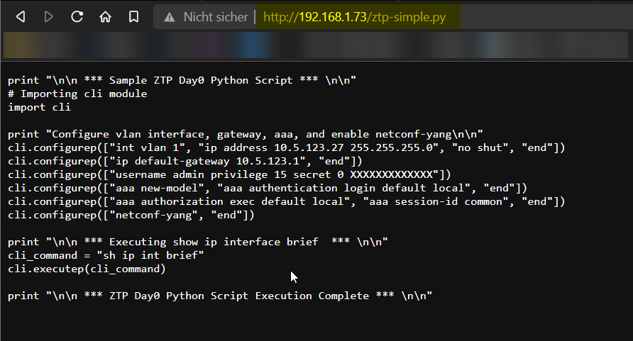

# Zero Touch Provisioning with Cisco IOS XE and Raspberry Pi

This is a learning project I undertook in my time at the Linux and Networking team as a part of my apprenticeship @Aveniq.

This README is forked from: <https://github.com/flopach/ztp2go>

## Key Features

During the boot process of the switch, the DHCP server gives the switch the location of the ZTP python script (located on the webserver). Then the switch loads the file and executes all the defined configuration commands for provisioning.

* Automatically configures Cisco switches
  * Catalyst 9300



* Forked README: <https://github.com/flopach/ztp2go>
* ZTP Repo: <https://github.com/jeremycohoe/c9300-ztp>

## Configuration Steps

### 1. Configuration of the local network (e.g. eth0) = Ethernet port of RasPi

`sudo vim /etc/network/interfaces.d/eth0`

Example config:

```
auto eth0
iface eth0 inet static
hwaddress b8:27:eb:43:80:fe
address 10.100.10.100
netmask 255.255.255.0
gateway 10.100.10.1
```

### 2. Install ISC DHCP-Server on the Raspberry Pi

```bash
sudo apt install isc-dhcp-server

sudo vim /etc/dhcp/dhcpd.conf
```

Add the following lines to the dhcpd.conf and modify the subnet to your local enviroment:

```
option domain-name "localhost.localdomain";
default-lease-time 600;
max-lease-time 7200;
ddns-update-style none;
#option ip-tftp-server code 150 = { ip-address };
authoritative;
# DHCP range for ZTP on C9300
subnet 192.168.1.0 netmask 255.255.255.0 {
        range 192.168.1.10 192.168.1.20;
        option domain-name "localhost.localdomain";
        option subnet-mask 255.255.255.0;
        option broadcast-address 192.168.1.255;
        default-lease-time 600;
        max-lease-time 7200;
        option bootfile-name "http://192.168.1.40/ztp-simple.py";
}
```

Edit the interfaces file

```bash
sudo vim /etc/default/isc-dhcp-server
```

```
INTERFACESv4="eth0"
INTERFACESv6=""
```

Start the DHCP server with:

```bash
#start the dhcp server
sudo systemctl restart isc-dhcp-server

sudo systemctl status isc-dhcp-server
```

### 3. Install Webmin for smooth configuration of Ubuntu Server 20.04 on Raspberry Pi (optional)

We recommend to use the graphical tool [Webmin](https://www.webmin.com/) for managing.

```bash
sudo apt-get install perl libnet-ssleay-perl openssl libauthen-pam-perl libpam-runtime libio-pty-perl apt-show-versions python unzip

wget http://prdownloads.sourceforge.net/webadmin/webmin_1.991_all.deb

sudo dpkg --install webmin_1.991_all.deb
```

### 4. Prepare Python Files

This ZTP Python script is based of [Jeremy Cohoe's c9300-ztp](https://github.com/jeremycohoe/c9300-ztp). The simplified version in this Repo is called: `ztp-homelab.py`

```bash
# download the original ZTP script
sudo apt install git
git clone https://github.com/jeremycohoe/c9300-ztp
```

### 5. Setup Webserver

We need to set up a webserver from where the switch can pull the python file.

We used Apache: `sudo apt install apache2`

Then, copy your ZTP Python script to the webserver access folder:

`sudo cp ztp-simple.py /var/www/html/ztp-simple.py`

Check if you can load the Python file with any connected browser.


### 6. Start Process

Now you are ready to start the process. At first start the raspberry pi + services, connect to the switch and then boot the switch:


Some helpful commands:

```
# Webmin DHCP GUI
https://localhost:10000/

# DHCP logging command
sudo tail -F /var/log/syslog |grep -i dhcp

# Apache2 looging command (tail)
sudo tail -F /var/log/apache2/access.log
```
